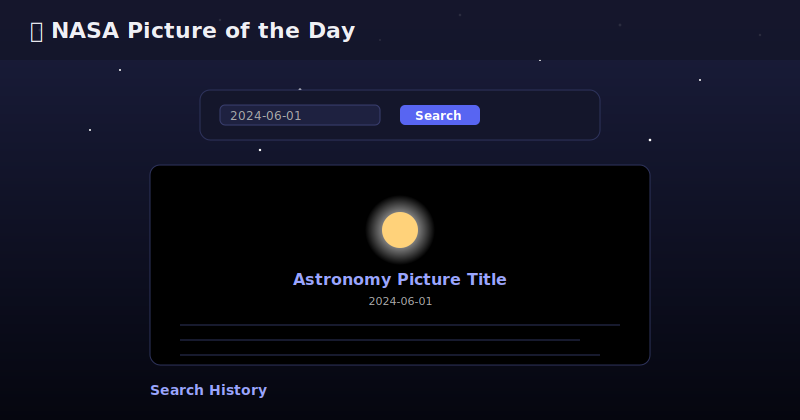

# 🚀 NASA Picture of the Day

A simple, vanilla JavaScript web app that fetches and displays images (or videos) from NASA's **Astronomy Picture of the Day (APOD)** API. Users can browse today's picture, search for a specific date, and revisit past searches — all saved locally in the browser.



## ✨ Features

- 🌌 Automatically loads **today's** NASA picture on page load
- 📅 Search for the astronomy picture on any past date
- 💾 Saves your search history to `localStorage` — persists across sessions
- 🕘 Click any past search to instantly re-fetch and view it again
- 🎥 Handles both images **and** videos returned by the API
- ⏳ Loading state while data is being fetched
- ⚠️ Graceful error handling for failed API requests

## 🖥️ Demo

Open `index.html` in your browser, or serve it locally:

```bash
# using VS Code Live Server, or:
npx serve .
```

> `fetch` can behave inconsistently when opening `index.html` directly via `file://` in some browsers — a local server is recommended.

## 🛠️ Tech Stack

- **HTML5** — semantic structure
- **CSS3** — custom styling, no frameworks
- **Vanilla JavaScript** — DOM manipulation, `fetch` API, `localStorage`
- **[NASA APOD API](https://api.nasa.gov/)** — data source

## 📂 Project Structure

```
.
├── index.html      # Page structure: form, image container, history list
├── style.css       # Styling for layout, form, cards, and history list
├── script.js       # Fetch logic, rendering, and localStorage handling
└── README.md
```

## ⚙️ Setup

1. **Clone the repo**
   ```bash
   git clone https://github.com/<your-username>/<repo-name>.git
   cd <repo-name>
   ```

2. **Get a free NASA API key**
   Sign up at [api.nasa.gov](https://api.nasa.gov/) — the key arrives by email within seconds.

3. **Add your key**
   Open `script.js` and replace the placeholder:
   ```js
   const API_KEY = "DEMO_KEY"; // 👈 replace with your own key
   ```
   > `DEMO_KEY` works out of the box but is rate-limited to ~30 requests/hour. Your own key raises that limit significantly.

4. **Open the app**
   Just open `index.html` in a browser, or run a local dev server.

## 🧠 How It Works

| Function | Responsibility |
|---|---|
| `getCurrentImageOfTheDay()` | Fetches and displays today's picture on page load |
| `getImageOfTheDay(date)` | Fetches a picture for a chosen date, saves it, and refreshes history |
| `saveSearch(date)` | Persists the searched date into a `searches` array in `localStorage` |
| `addSearchToHistory()` | Reads saved dates from `localStorage` and renders them as clickable list items |
| `renderApod(data)` | Shared render helper — safely injects image/video, title, date, and explanation using `textContent` (XSS-safe) |

## 🔒 Security Notes

- All API response data is inserted via `textContent`, never `innerHTML`, to avoid XSS from untrusted API content.
- The API key lives client-side in `script.js` — fine for a demo/learning project, but avoid committing a *real* production key to a public repo. Consider a `.env` + build step or a backend proxy for anything beyond personal/educational use.

## 📸 API Reference

```
GET https://api.nasa.gov/planetary/apod?date=YYYY-MM-DD&api_key=YOUR_KEY
```

| Param | Description |
|---|---|
| `date` | The date to fetch (format: `YYYY-MM-DD`) |
| `api_key` | Your NASA API key |

## 📝 License

This project is open source and available under the [MIT License](LICENSE).

## 🙌 Acknowledgments

- [NASA Open APIs](https://api.nasa.gov/) for the APOD data
- Built as part of an AccioJobs project assignment
